# 基于钛极OS(TiJOS)的阿里云IOT接入案例

阿里云物联网套件是阿里云专门为物联网领域的开发人员推出的，其目的是帮助开发者搭建安全性能强大的数据通道，方便终端（如传感器、执行器、嵌入式设备或智能家电等等）和云端的双向通信。全球多节点部署让海量设备全球范围都可以安全低延时接入阿里云IoT Hub，安全上提供多重防护保障设备云端安全，性能上能够支撑亿级设备长连接，百万消息并发。物联网套件还提供了一站式托管服务，数据从采集到计算到存储，用户无需购买服务器部署分布式架构，用户通过规则引擎只需在web上配置规则即可实现采集+计算+存储等全栈服务。

总而言之，基于物联网套件提供的服务，物联网开发者可以快速搭建稳定可靠的物联网平台。

## 代码说明

| 目录       | 说明                           |
| -------- | ---------------------------- |
| TiJOSApp | 钛极OS(TiJOS)应用源码,可运行于TiKit开发板 |
|          |                              |

## 开通阿里云

在使用前我们需要先开通阿里云的物联网套件，进入阿里云官网注册完账户后进入管理控制台，在产品与服务中选择物联网套件（使用物联网套件需要激活，请参考官方教程自行激活功能）。在物联网套件中创建产品，此处取名TiJOS。创建成功后可以在产品管理中看到相应的产品，点击产品可以看到产品的详细信息，其中productKey将会在代码中使用到，请复制保存。

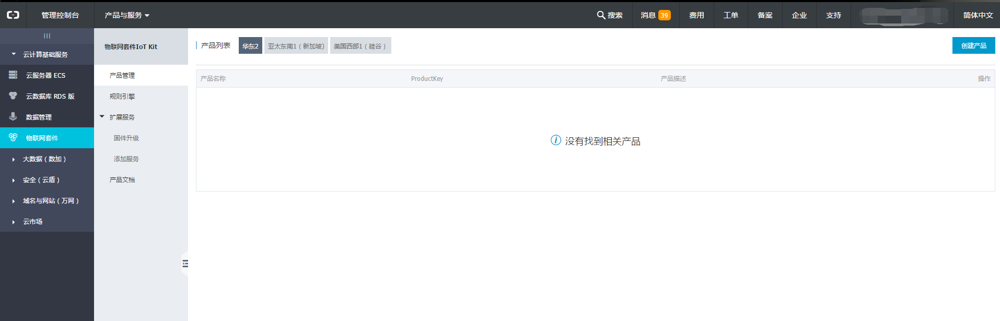

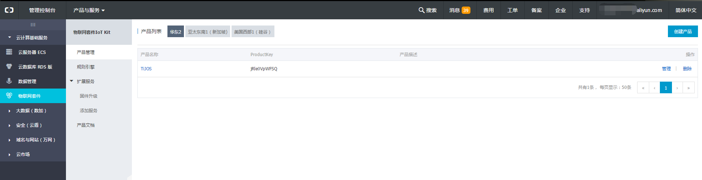

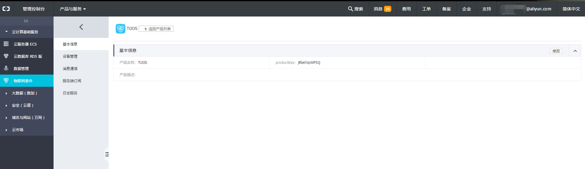

接着点击消息通讯菜单，可以看到物联网套件预制的Topic列表，此处点击定义Topic类按钮创建一个用于测试的Topic，取名message，设备操作权限为发布和订阅。

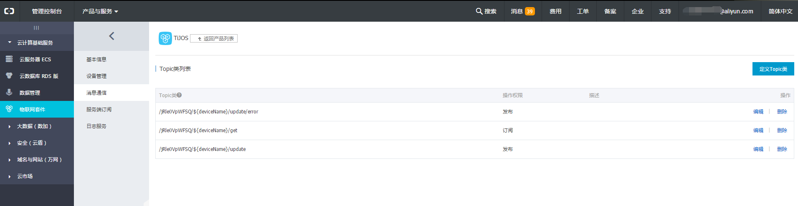

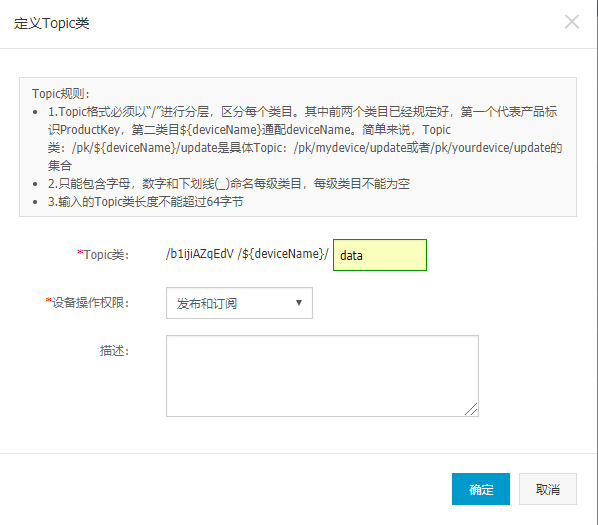

继续点击菜单中的设备管理，然后点击添加设备按钮弹出对话框并输入设备名称，建议输入设备中获取的硬件名称，此处输入tikit-demo。创建成功后点击设备名称可以看见设备的创建信息，此处的deviceSecret需要记录，代码中将会使用到。

### 创建设备

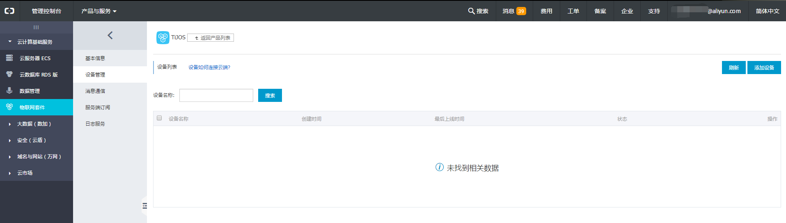

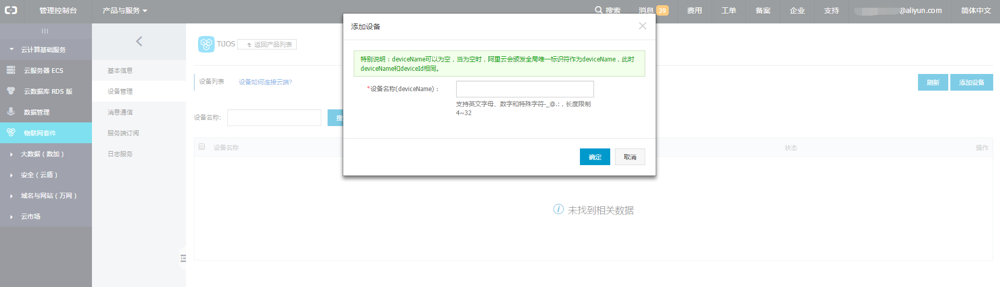

### 设备列表

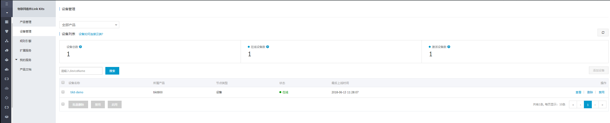

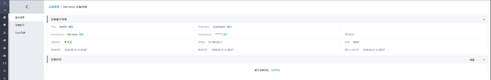

### 创建Topic

从产品管理页面下为该设备创建可发布可订阅的TOPIC:  data  ,如下图所示:

## 接入网络

在开发前需要将TiKit-T600-ESP8266A开发板接入网络，TiKit-T600-ESP8266A支持WIFI，通过TiDeviceManager工具设置网络接入参数。开发板连接电脑后，在TiDeviceManager菜单中点击设备属性按钮弹出对话框选择WLAN选项卡，输入无线网络名称和无线密码完成配置，开发板重启后即自动连接到指定的网络。

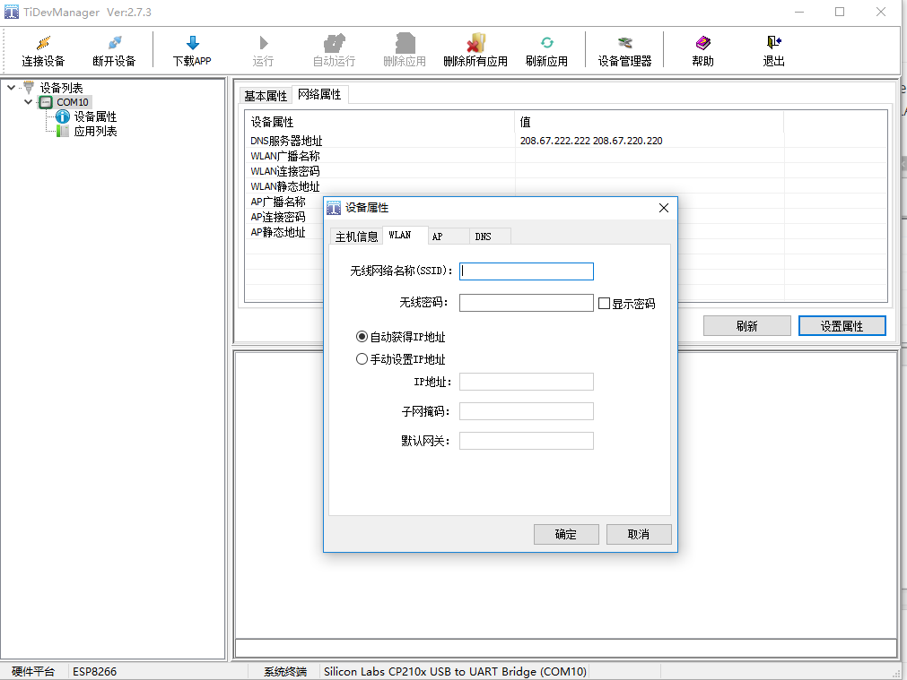

## 代码编译

从GitHub下载已完成的代码，通过TiStudio导入到Workspace中（注：TiStudio工具的安装请参考文档《TiStudio用户手册》）。在TiStudio中可以看到工程基于TiJOS Framework开发，所有源码和API都是Java代码，依托于Java的跨平台特性，我们可以将代码运行在任何硬件平台上。TiJOS Framework对各种外设传感器做了抽象封装，通过API可方便快捷的操作外设硬件。下面将修改工程源码进行上线前调试。

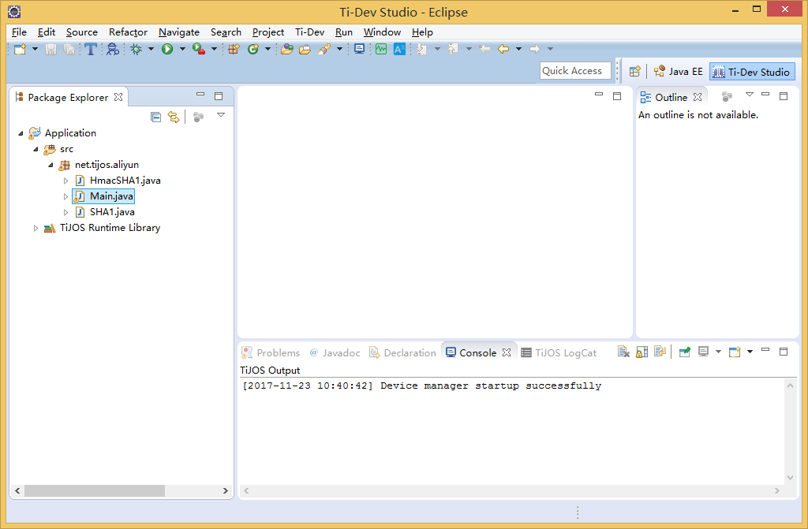

转到包net.tijos.aliyun下找到Main类，Main类包含基于MQTT协议的接入阿里云的代码，在代码前面部分有与连接相关的常量参数，分别对应设备名称、broker地址、用户名、用户密码。将参数修改为我们前面阿里云物联网套件下对应的数据，然后保存。接着将修改后的代码下载至设备中，下载步骤选中工程右键弹出菜单点击Run as --> TiJOS Application实时下载至硬件中。

至此设备成功接入阿里云物联网，通过topic与阿里云IOT Hub通讯收发数据。

### 查看日志

从阿里云产品管理下的日志服务中选择上行消息分析，即可看到设备发送到阿里云的日志：

## 总结

本案例实现了最基本的网络接入和IOT收发数据，而在实际产品设计中可自定义topic，通过阿里云的策略对数据进行转发，同时基于阿里云的云服务优势对数据做处理分析，以及大数据运算和存储等。